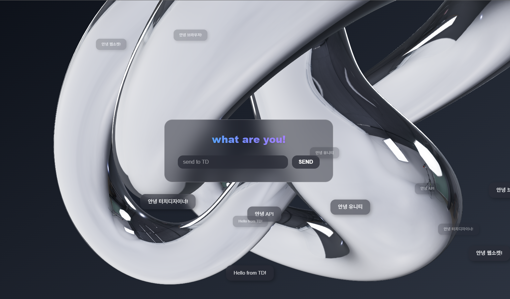

# TD Web Interaction



TouchDesigner와 웹 브라우저 간 실시간 데이터 송수신 프로젝트

## 📋 개요

실시간 데이터 비주얼라이제이션 파이프라인:  
**TouchDesigner ↔ Node.js WebSocket Server ↔ Next.js (React + Three.js)**

서버는 데이터를 중계하고, 브라우저는 이를 3D 그래픽으로 렌더링합니다.

---

## 🗂️ 프로젝트 구조

```
td-web-interaction/
├── app/
│   ├── api/
│   │   └── users/
│   │       └── route.ts
│   ├── components/
│   │   ├── GlassObject.tsx      # 유리 재질 3D 오브젝트
│   │   ├── Lights.tsx            # 조명 설정
│   │   └── SceneCanvas.tsx       # Three.js 캔버스
│   ├── favicon.ico
│   ├── globals.css
│   ├── layout.tsx
│   └── page.tsx                  # 메인 페이지
├── lib/
│   └── logger.ts                 # 로깅 유틸리티
├── public/
│   └── textures/
│       └── studio_small_08_1k.hdr # HDR 환경맵
├── server/
│   └── websocket-server.js       # WebSocket 중계 서버
├── .gitignore
├── eslint.config.mjs
├── next.config.ts
├── package.json
├── tsconfig.json
└── README.md
```

---

## 🏗️ 아키텍처

### 1. Next.js 계층

```
┌────────────────────────────────────────────────────────┐
│ page.tsx                                               │
│   <SceneCanvas /> ─────▶ SceneCanvas.tsx               │
│       └──▶ GlassObject.tsx                             │
└────────────────────────────────────────────────────────┘
```

| 파일 | 역할 |
|------|------|
| `page.tsx` | 앱 진입점 |
| `SceneCanvas.tsx` | Three.js 렌더링 무대 |
| `GlassObject.tsx` | 3D 메시 + 회전 애니메이션 |

### 2. WebSocket 서버

| 포트 | 용도 | 연결 대상 |
|------|------|------------|
| 9091 | WebSocket | TouchDesigner |
| 9092 | WebSocket | 브라우저 |

```
┌──────────────────────────────────────────────────────────────┐
│ websocket-server.js                                          │
│──────────────────────────────────────────────────────────────│
│ TD(9091) ◄── WebSocket Server ──► Browser(9092)              │
│ 양방향 데이터 중계 (TD ↔ 브라우저)                          │
└──────────────────────────────────────────────────────────────┘
```

### 3. 렌더링 파이프라인

```
┌──────────────────────────────────────────────────────────────┐
│ <SceneCanvas>                                                │
│   <Canvas>                                                   │
│     <Lights />                                               │
│     <Environment />                                          │
│     <GlassObject /> ← 3D 메시 렌더링                         │
│   </Canvas>                                                  │
│ </SceneCanvas>                                               │
└──────────────────────────────────────────────────────────────┘
```

---

## 🔄 데이터 흐름

```
① TouchDesigner → Node.js(9091)  : 실시간 데이터 전송
② Node.js → Browser(9092)        : 브로드캐스트
③ Browser → Node.js(9092→9091)   : 좌표/입력값 전송
④ Browser → Three.js             : 3D 시각화
```

---

## ⚡ 빠른 실행

### 1. Node.js 설치 확인

```bash
C:\Users> node --version
C:\Users> npm --version
```

Node.js 미설치 시: https://nodejs.org/ 에서 다운로드

### 2. 프로젝트 실행

```bash
# 프로젝트 폴더로 이동
C:\Users> cd Desktop/test-log-json/td-web-interaction

# 의존성 설치
C:\Users\Desktop\test-log-json\td-web-interaction> npm install

# WebSocket 서버 시작 (터미널 1)
C:\Users\Desktop\test-log-json\td-web-interaction> cd server
C:\Users\Desktop\test-log-json\td-web-interaction\server> node websocket-server.js

# Next.js 개발 서버 시작 (새 터미널 2)
C:\Users\Desktop\test-log-json\td-web-interaction> npm run dev

# 브라우저에서 http://localhost:3000 접속
```

### TouchDesigner 연결
```python
op('websocket1').sendText('Hello from TD!')
```

---

## 🚀 시작하기

### 필수 요구사항

- Node.js 18+
- TouchDesigner

### 설치

```bash
npm install
```

### 실행

```bash
# WebSocket 서버 시작
node server/websocket-server.js

# Next.js 개발 서버 시작
npm run dev
```

### TouchDesigner 데이터 전송 예시

```python
op('websocket1').sendText('Hello from TD!')
```

---

## 🛠️ 기술 스택

- **Frontend:** Next.js, React, Three.js, @react-three/fiber
- **Backend:** Node.js, WebSocket
- **3D:** Three.js, MeshPhysicalMaterial
- **언어:** TypeScript

---

## 📌 핵심 기능

- TouchDesigner ↔ 브라우저 간 양방향 실시간 통신
- React + Three.js 기반 3D 렌더링
- 유리 재질(Glass Material) 물리 기반 렌더링
- HDR 환경맵 지원
