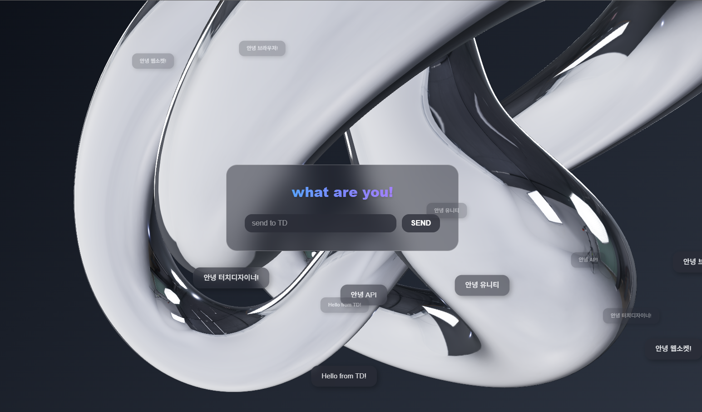
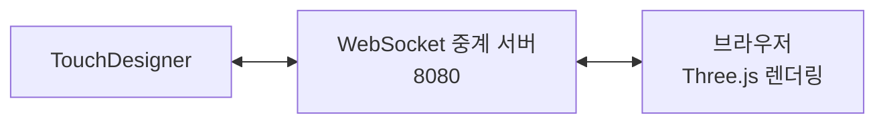

# TD Web Interaction

[](https://github.com/devmyungduk/td-web-interaction/actions/workflows/deploy.yml)

> TouchDesigner가 보낸 값을 브라우저에서 받아 Three.js로 시각화합니다.



**[데모 열기](https://devmyungduk.github.io/td-web-interaction/)** — 설치 없이 화면 동작을 확인할 수 있습니다. 연결할 서버가 없으면 데모 모드로 전환되어 예시 데이터가 흐릅니다.

## 두 저장소의 역할

중계 서버는 양쪽 모두 양방향입니다. 차이는 브라우저 화면이 무엇을 구현했는지입니다.

| | [touchdesigner-web-bridge](https://github.com/devmyungduk/touchdesigner-web-bridge) | 이 저장소 |
|---|---|---|
| 브라우저 → TouchDesigner | 터치 좌표 · 텍스트 | 마우스 좌표 · 텍스트 |
| TouchDesigner → 브라우저 | 구현하지 않음 | 떠다니는 메시지 |
| 브라우저 화면 | 입력 컨트롤러 | Three.js 3D 시각화 |
| 배포 데모 | 없음 | GitHub Pages |

포트와 메시지 형식이 같아 어느 쪽 중계 서버를 써도 동작합니다.

## 구조


```mermaid
flowchart LR
  T["TouchDesigner"] <--> S["WebSocket 중계 서버<br/>8080"]
  S <--> B["브라우저<br/>Three.js 렌더링"]
```

한 포트에 양쪽이 접속하고, 서버는 받은 메시지를 보낸 쪽을 제외한 모든 접속자에게 전달합니다.

## 실행

Node.js 22 이상이 필요합니다. 없으면 [nodejs.org](https://nodejs.org/)에서 설치합니다.

```bash
npm install
npm run dev
```

한 명령으로 Next.js 개발 서버와 중계 서버가 함께 뜹니다. 브라우저에서 `http://localhost:3000`을 엽니다. 따로 띄우려면 `npm run dev:web`과 `npm run dev:ws`를 씁니다.

## 휴대기기에서 접속

서버가 뜨면 접속 주소가 출력됩니다.

```
WebSocket 서버: ws://localhost:8080
같은 네트워크에서 접속할 주소:
  ws://192.168.0.10:8080   (웹 화면은 http://192.168.0.10:3000)
```

출력된 `http://<주소>:3000`을 같은 공유기에 연결된 휴대기기에서 엽니다. 클라이언트가 접속한 호스트로 WebSocket을 연결하므로 코드나 설정을 고칠 필요가 없습니다.

연결되지 않으면 PC와 휴대기기가 같은 네트워크에 있는지, 방화벽이 `3000`·`8080` 인바운드를 막지 않는지 확인합니다.

## TouchDesigner 연결

[TouchDesigner](https://derivative.ca/download)는 비상업 용도 무료 버전이 있습니다.

1. **WebSocket DAT**를 추가합니다.
2. `Network Address`를 `localhost`, `Network Port`를 `8080`으로 설정합니다.
3. `Active`를 켭니다.

### 브라우저로 보내기

```python
op('websocket1').sendText('audio peak 0.82')
```

Execute DAT이나 CHOP Execute DAT에 넣어 원하는 시점에 실행합니다. 오디오 레벨, CHOP 값, 타이머 등을 문자열로 만들어 보냅니다. 이 호출을 추가하지 않으면 브라우저에 메시지가 나타나지 않습니다.

### 브라우저에서 받기

브라우저가 보내는 값은 WebSocket DAT의 콜백 DAT(`onReceiveText`)로 들어옵니다.

```json
{ "type": "mouse", "x": 512, "y": 300, "time": "14:23:05" }
{ "type": "text",  "content": "입력한 문자열", "time": "14:23:11" }
```

```python
import json

def onReceiveText(dat, rowIndex, message, bytes):
    data = json.loads(message)
    if data['type'] == 'mouse':
        op('constant1').par.value0 = data['x']
        op('constant1').par.value1 = data['y']
    elif data['type'] == 'text':
        op('text1').par.text = data['content']
    return
```

`touchdesigner-web-bridge`는 여기에 `type: "click"`을 더 보냅니다. 같은 콜백에서 함께 처리할 수 있습니다.

## 구성

```
app/
  page.tsx              화면. WebSocket 연결, 입력, 메시지 표시
  components/
    SceneCanvas.tsx     Three.js 캔버스와 HDR 환경맵
    GlassObject.tsx     유리 재질 오브젝트
lib/
  config.ts             접속 주소와 상수
  simulator.ts          서버가 없을 때 쓰는 데모용 생성기
server/
  websocket-server.mjs  중계 서버
public/textures/        HDR 환경맵
```

Next.js 16 · React 19 · TypeScript · Three.js · @react-three/fiber · @react-three/drei · Framer Motion · Tailwind CSS 4 · ws

## 설정

| 환경변수 | 기본값 | 용도 |
|---|---|---|
| `WS_PORT` | `8080` | 중계 서버가 열 포트 |
| `WS_VERBOSE` | 미설정 | `1`이면 중계한 메시지를 콘솔에 출력 |
| `NEXT_PUBLIC_WS_PORT` | `8080` | 브라우저가 접속할 포트 |
| `NEXT_PUBLIC_WS_URL` | 미설정 | 접속 주소를 직접 지정. 호스트 자동 감지를 대신합니다 |
| `NEXT_PUBLIC_BASE_PATH` | 빈 값 | 정적 배포 시 하위 경로. 배포 워크플로우가 설정 |

포트를 바꾸려면 `WS_PORT`와 `NEXT_PUBLIC_WS_PORT`를 같은 값으로 맞춥니다.

입력 기록은 브라우저 `localStorage`에 저장되고 최근 5개만 남습니다.

## 배포

`main`에 반영되면 GitHub Actions가 정적 파일로 빌드해 GitHub Pages에 올립니다. 서버가 필요 없으므로 포크한 저장소에서 Pages만 켜면 그대로 동작합니다.

정적 파일을 직접 얻으려면 아래를 실행하고 `out/`을 원하는 웹서버에 올립니다.

```bash
npm run build
```

배포된 페이지는 로컬 중계 서버에 접속할 수 없어 데모 모드로 동작합니다. TouchDesigner와 연결하려면 저장소를 받아 로컬에서 실행합니다.

## 문제 해결

| 증상 | 확인 |
|---|---|
| 상태 표시가 `데모 모드`로 남음 | 중계 서버가 실행 중인지, 포트가 같은지 확인 |
| `EADDRINUSE` | 다른 프로세스가 `8080`을 쓰고 있음. `WS_PORT`를 바꾸거나 해당 프로세스를 종료 |
| 휴대기기에서 화면이 안 열림 | 같은 네트워크인지, 방화벽이 `3000`·`8080`을 막지 않는지 확인 |
| 떠다니는 메시지가 안 나옴 | TouchDesigner에서 `sendText`를 호출하는 노드를 추가했는지 확인 |
| TouchDesigner가 값을 못 받음 | `WS_VERBOSE=1`로 서버를 띄워 중계가 일어나는지 확인 |
| 3D 씬이 검게 나옴 | 브라우저 콘솔에서 HDR 환경맵 요청이 404인지 확인 |

## 라이선스

이용 조건은 [LICENSE](LICENSE)를 확인하세요. HDR 환경맵 등 외부 리소스에는 각 제작자의 별도 라이선스가 적용될 수 있습니다.

질문과 오류 제보는 Issues를 이용해 주세요.
