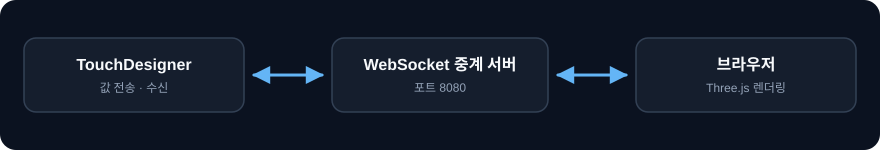

# TD Web Interaction

[](https://github.com/devmyungduk/td-web-interaction/actions/workflows/deploy.yml)

> TouchDesigner가 보낸 값을 브라우저에서 Three.js로 시각화하고, 브라우저의 마우스 좌표와 텍스트를 TouchDesigner로 돌려보냅니다.


**[데모 열기](https://devmyungduk.github.io/td-web-interaction/)** — 설치 없이 화면을 볼 수 있습니다. 배포된 페이지는 중계 서버에 접속할 수 없어, TouchDesigner가 보낼 만한 값을 대신 만들어 띄웁니다. 화면에 떠오르는 메시지가 수신 결과입니다.

## 구조



브라우저와 TouchDesigner는 서로 직접 연결하지 않고, 같은 중계 서버에 각자 접속합니다.

- 서버는 받은 메시지를 보낸 쪽을 뺀 모든 접속자에게 전달합니다.
- 양쪽을 구분하지 않으므로 접속 주소는 `ws://<PC 주소>:8080`으로 같습니다.
- TouchDesigner는 문자열을, 브라우저는 JSON 문자열 한 줄을 보냅니다. 형식은 [TouchDesigner 연결](#touchdesigner-연결)에 있습니다.

## 실행

Node.js 22 이상이 필요합니다. 없으면 [nodejs.org](https://nodejs.org/)에서 설치합니다.

```bash
git clone https://github.com/devmyungduk/td-web-interaction.git
cd td-web-interaction
npm install
npm run dev
```

한 명령으로 Next.js 개발 서버와 중계 서버가 함께 뜨고, 접속 주소가 출력됩니다.

```
WebSocket 서버: ws://localhost:8080
같은 네트워크에서 접속할 주소:
  ws://192.168.0.10:8080   (웹 화면은 http://192.168.0.10:3000)
```

PC에서는 `http://localhost:3000`을 엽니다. 따로 띄우려면 `npm run dev:web`과 `npm run dev:ws`를 씁니다.

## 휴대폰에서 접속

출력된 `http://<주소>:3000`을 같은 공유기에 연결된 휴대폰에서 엽니다. 웹 화면은 자신이 열린 주소로 WebSocket을 연결하므로 코드나 설정을 고칠 필요가 없습니다.

연결되지 않으면 다음을 확인합니다.

- PC와 휴대폰이 같은 네트워크에 있는지
- 방화벽이 `3000`·`8080` 인바운드를 막지 않는지

## TouchDesigner 연결

[TouchDesigner](https://derivative.ca/download)를 설치합니다.

1. **WebSocket DAT**를 추가합니다.
2. `Network Address`를 `localhost`, `Network Port`를 `8080`으로 설정합니다.
3. `Active`를 켭니다.

접속되면 웹 화면 위쪽 표시가 `TouchDesigner 연결됨`으로 바뀝니다. 중계 서버를 찾지 못하면 `데모 모드`로 바뀌고, 이때는 실제 값 대신 만들어 낸 값이 화면에 뜹니다.

### 브라우저로 보내기

```python
op('websocket1').sendText('audio peak 0.82')
```

Execute DAT이나 CHOP Execute DAT에 넣어 원하는 시점에 실행합니다. 오디오 레벨, CHOP 값, 타이머 등을 문자열로 만들어 보냅니다. 이 호출을 추가하지 않으면 브라우저에 메시지가 나타나지 않습니다.

### 브라우저에서 받기

브라우저는 마우스가 움직이면 좌표를 0.1초 간격으로 보내고, 입력창에서 전송하면 텍스트를 보냅니다. 두 값 모두 WebSocket DAT의 콜백 DAT(`onReceiveText`)로 들어옵니다.

```json
{ "type": "mouse", "x": 512, "y": 300, "time": "14:23:05" }
{ "type": "text",  "content": "입력한 문자열", "time": "14:23:11" }
```

```python
import json

def onReceiveText(dat, rowIndex, message):
    data = json.loads(message)
    if data['type'] == 'mouse':
        op('constant1').par.value0 = data['x']
        op('constant1').par.value1 = data['y']
    elif data['type'] == 'text':
        op('text1').par.text = data['content']
    return
```

## 구성

| 경로 | 내용 |
|---|---|
| `app/page.tsx` | 화면. 연결과 입력, 메시지 표시 |
| `app/components/SceneCanvas.tsx` | Three.js 캔버스와 환경맵 |
| `app/components/GlassObject.tsx` | 유리 재질 오브젝트 |
| `lib/config.ts` | 접속 주소와 상수 |
| `lib/simulator.ts` | 데모 모드용 값 생성기 |
| `server/websocket-server.mjs` | 중계 서버 |
| `public/textures/` | HDR 환경맵 |

Next.js 16 · React 19 · TypeScript · Three.js · @react-three/fiber · @react-three/drei · Framer Motion · Tailwind CSS 4 · ws

## 설정

| 환경변수 | 기본값 | 용도 |
|---|---|---|
| `WS_PORT` | `8080` | 서버가 열 포트 |
| `WS_VERBOSE` | 미설정 | `1`이면 중계 내역을 콘솔에 출력 |
| `NEXT_PUBLIC_WS_PORT` | `8080` | 브라우저가 접속할 포트 |
| `NEXT_PUBLIC_WS_URL` | 미설정 | 접속 주소 직접 지정 |
| `NEXT_PUBLIC_BASE_PATH` | 빈 값 | 정적 배포 시 하위 경로 |

포트를 바꾸려면 `WS_PORT`와 `NEXT_PUBLIC_WS_PORT`를 같은 값으로 맞춥니다.

입력 기록은 브라우저 `localStorage`에 저장되고 최근 5개만 남습니다.

## 배포

`main`에 반영되면 GitHub Actions가 정적 파일로 빌드해 GitHub Pages에 올립니다. 서버가 필요 없으므로 포크한 저장소에서 Pages만 켜면 그대로 동작합니다.

정적 파일을 직접 얻으려면 아래를 실행하고 `out/`을 원하는 웹서버에 올립니다.

```bash
npm run build
```

## 문제 해결

| 증상 | 확인 |
|---|---|
| 상태 표시가 `데모 모드`로 남음 | 서버가 실행 중인지, 포트가 같은지 |
| `EADDRINUSE` | `8080`을 쓰는 프로세스를 종료하거나 `WS_PORT` 변경 |
| 떠다니는 메시지가 안 나옴 | TouchDesigner에서 `sendText`를 호출했는지 |
| TouchDesigner가 값을 못 받음 | `WS_VERBOSE=1`로 띄워 중계가 일어나는지 |
| 3D 씬이 검게 나옴 | 콘솔에서 환경맵 요청이 404인지 |

## 라이선스

이용 조건은 [LICENSE](LICENSE)에 있습니다. HDR 환경맵 등 외부 리소스에는 각 제작자의 별도 라이선스가 적용될 수 있습니다.

질문과 오류 제보는 Issues를 이용합니다.
